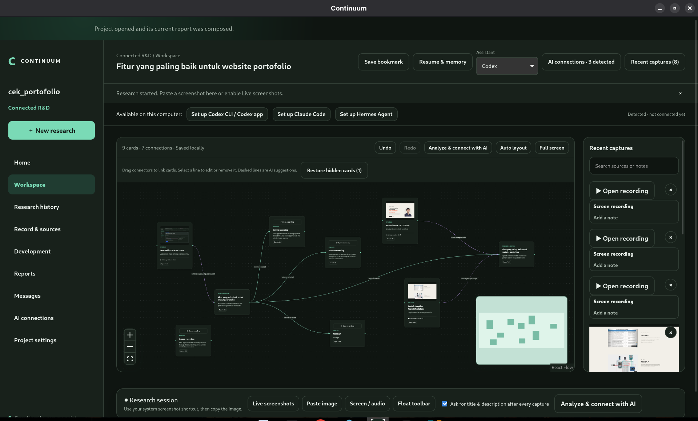
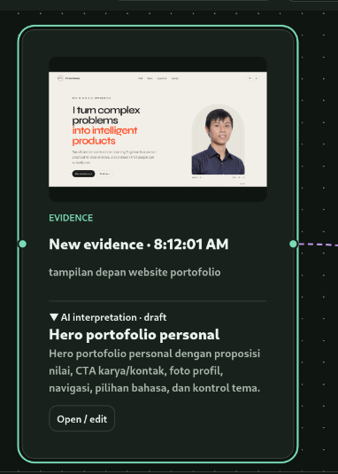
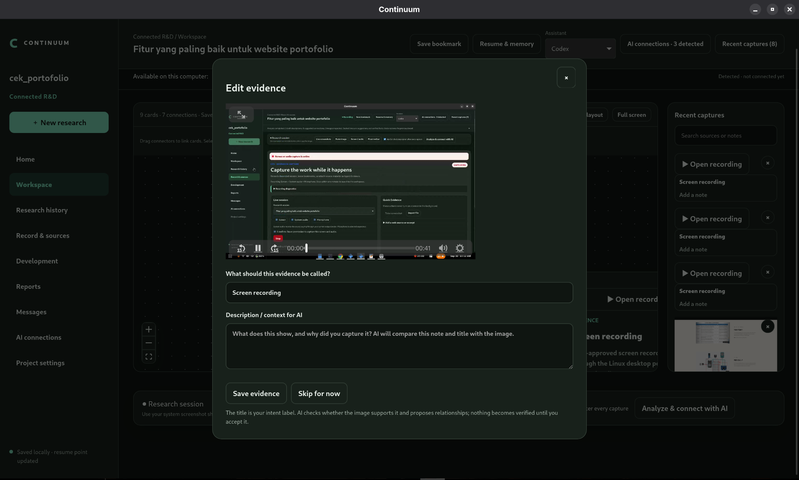
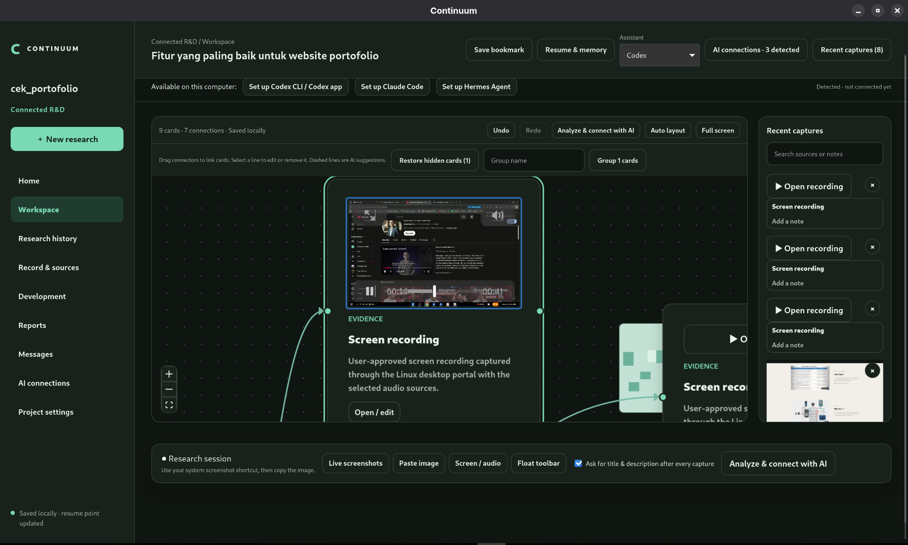
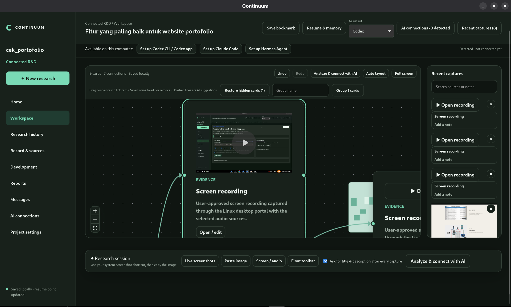
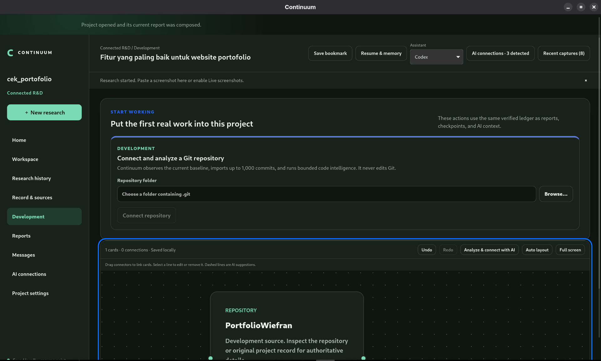
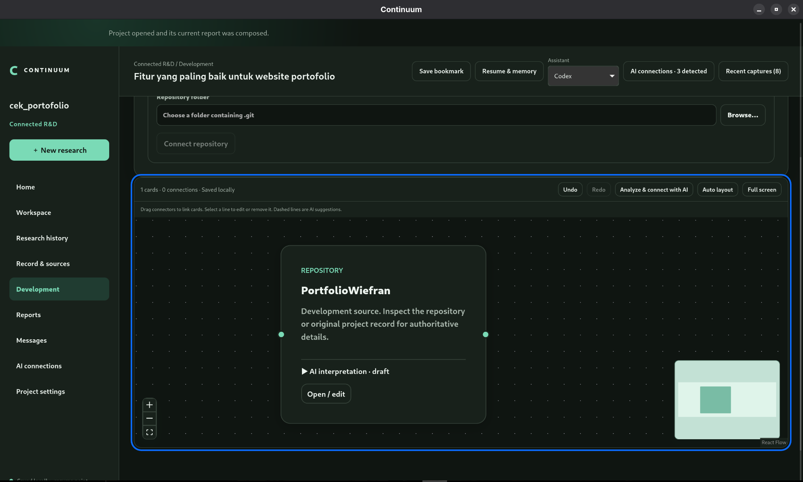
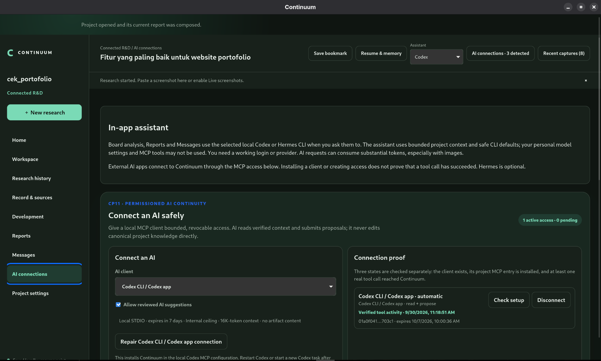
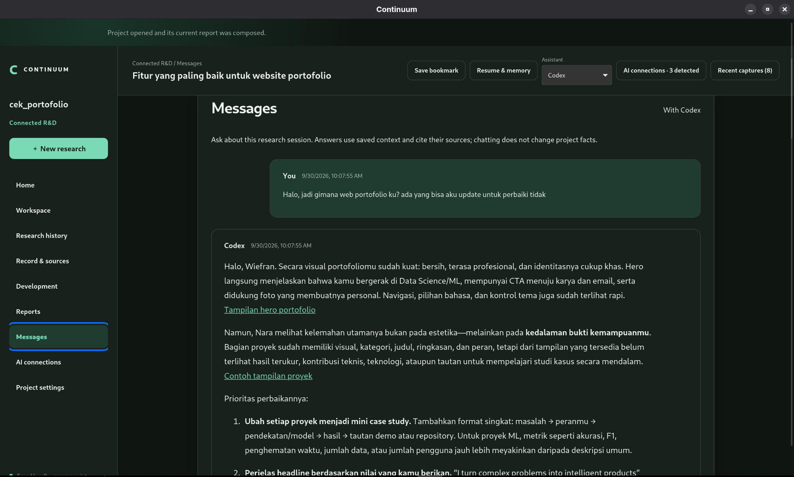
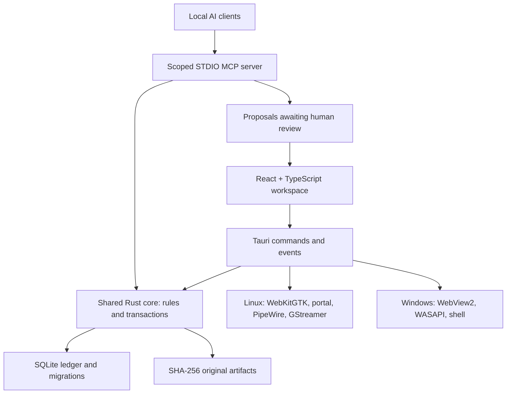

# Continuum

Continuum adalah aplikasi desktop *local-first* untuk riset dan pengembangan. Satu proyek menyimpan tujuan riset, bukti (gambar, rekaman, audio, berkas, dan sumber web), posisi kartu dan hubungan di workspace, catatan keputusan, riwayat pengembangan, percakapan AI, checkpoint/memory, dan laporan Markdown. AI membantu menganalisis dan mengusulkan perubahan; manusia tetap meninjau usulan sebelum menjadi pengetahuan terverifikasi.

## Unduh aplikasi — Linux dan Windows x64

**[⬇ Unduh AppImage Continuum terbaru yang telah diuji (0.12.0 · 1 Oktober 2026)](https://github.com/WiefranVarenzo/Continuum/releases/download/v0.12.0-linux-pilot-2026-10-01/Continuum_0.12.0_amd64.AppImage)**

Repository ini sekarang public; aplikasi tersedia melalui GitHub Releases. Tautan di atas langsung menuju berkas aplikasi, **bukan** source code. Versi ini adalah *pre-release* Linux yang belum ditandatangani; lihat [semua rilis](https://github.com/WiefranVarenzo/Continuum/releases) untuk memeriksa apakah ada versi lebih baru. Windows fix2 tersedia sebagai pilot tersendiri dengan batas pengujian yang dijelaskan di bawah; macOS belum didukung.

Untuk AppImage Linux yang disimpan di `~/Downloads`, jalankan di terminal (sesuaikan path bila folder unduhanmu berbeda):

```bash
cd ~/Downloads
chmod +x Continuum_0.12.0_amd64.AppImage
./Continuum_0.12.0_amd64.AppImage
```

Untuk memastikan unduhan utuh, jalankan `sha256sum Continuum_0.12.0_amd64.AppImage` dan cocokkan hasilnya dengan `125ec2364eddcf6bdd3d8e136298e359a3d5cc2d0a8dd78a6bd3962f49007523` ([catatan rilis dan checksum](releases/0.12.0-github-upload-responsive-2026-10-01/README.md)). Tidak perlu meng-clone repository atau membangun source hanya untuk memakai AppImage.

**Mulai di sini:** [panduan pengguna](docs/cp12/CP12-USER-GUIDE.md) · [handover teknis untuk manusia/AI](docs/HANDOVER.md) · [panduan update dan perbaikan](docs/MAINTAINER-GUIDE.md) · [petunjuk agen](AGENTS.md) · [batasan platform](docs/cp12/CP12-PLATFORM-AND-KNOWN-LIMITATIONS.md).

## Windows x64 — installer fix2

**[⬇ Unduh installer Windows terbaru — 0.12.0 fix2](https://github.com/WiefranVarenzo/Continuum/releases/download/v0.12.0-windows-fix2/Continuum_0.12.0_Windows-fix2_x64-setup.exe)**

Jalankan `Continuum_0.12.0_Windows-fix2_x64-setup.exe` melalui akun Windows normal, lalu buka Continuum dari Start. Installer memasang aplikasi, server MCP, serta Git/Git LFS/GitHub CLI untuk aplikasi. WebView2 dipasang jika belum tersedia; setup runtime pertama dapat memerlukan internet. Pengguna aplikasi tidak perlu memasang Rust atau Node.js. Jangan membagikan hanya executable GUI tanpa resource pendamping.

Paket unsigned pilot: 60.893.044 byte, SHA-256 `4fc2f79d7602011be0ec1208ce33c5222645a6be45b92cee5c1d6d67acfc4f34`. Verifikasi dengan:

```powershell
Get-FileHash -Algorithm SHA256 -LiteralPath .\Continuum_0.12.0_Windows-fix2_x64-setup.exe
```

Screen dan system audio telah dilaporkan bekerja pada VM Windows pengujian. **Mikrofon fisik masih belum menghasilkan sinyal di VirtualBox referensi**, termasuk pada tes mic-only; paket ini belum diklaim setara penuh pada seluruh perangkat. Fix2 menambahkan pemilihan input, gain, meter, dan tes mikrofon. [Catatan fix2 dan batas verifikasi](docs/releases/WINDOWS-0.12.0-fix2.md) · [Instalasi dan troubleshooting](docs/INSTALLATION.md).

Rilis AppImage Linux di atas beserta hash dan riwayatnya dipertahankan. Windows diterbitkan pada tag terpisah `v0.12.0-windows-fix2`; gunakan [semua rilis](https://github.com/WiefranVarenzo/Continuum/releases), karena kedua paket adalah prerelease.

| Pilihan | Paket / panduan |
| --- | --- |
| Pakai Linux | [AppImage Linux](https://github.com/WiefranVarenzo/Continuum/releases/download/v0.12.0-linux-pilot-2026-10-01/Continuum_0.12.0_amd64.AppImage) |
| Pakai Windows x64 | [Installer Windows fix2](https://github.com/WiefranVarenzo/Continuum/releases/download/v0.12.0-windows-fix2/Continuum_0.12.0_Windows-fix2_x64-setup.exe) |
| Edit/build sendiri | Fork/clone repo; [panduan build lengkap](docs/development/BUILD-AND-DEVELOP.md) |
| Arsitektur | [Diagram dan matriks lintas platform](docs/architecture/CROSS-PLATFORM-ARCHITECTURE.md) |
| Kontribusi dan rilis | [CONTRIBUTING](CONTRIBUTING.md) · [Publikasi paket](docs/releases/PUBLISHING.md) |

## Preview aplikasi

Kesembilan gambar berikut berasal dari penggunaan Continuum di Linux pada proyek contoh milik pengguna. Ini menunjukkan tampilan aplikasi, bukan data bawaan yang akan muncul pada proyek baru. Beberapa teks dan hasil AI adalah contoh yang tetap perlu ditinjau manusia.

### Workspace dan hubungan antar-bukti

Workspace menampilkan kartu riset, gambar, rekaman, pertanyaan, dan garis hubungan yang dapat diatur.



Kartu gambar menyimpan catatan pengguna dan interpretasi AI sebagai draf yang terpisah.



### Bukti dan rekaman layar

Saat bukti dibuka, pengguna dapat memberi judul serta deskripsi untuk konteks AI dan laporan.



Rekaman dapat dilihat dan diputar langsung dari kartu workspace.





### Alur pengembangan

Bagian Development menghubungkan folder Git lokal sebagai sumber analisis *read-only* dan memunculkannya di workspace.





### AI dan percakapan

Halaman AI connections membedakan klien yang terdeteksi dari koneksi yang benar-benar pernah berhasil memanggil tool.



Messages menggunakan konteks tersimpan untuk menjawab pertanyaan dengan rujukan bukti; jawaban tetap perlu diperiksa.



## Cara memakai aplikasi

1. Di **Home**, buat proyek Research, Development, atau Connected R&D. Pilih folder lokal di luar repository source ini untuk data proyek.
2. Untuk riset, buat sesi dengan judul, pertanyaan, dan tujuan. Tempel/seret gambar, ambil screenshot, impor berkas, atau rekam melalui **Record & sources**. Beri setiap bukti judul dan konteks yang bermakna.
3. Atur kartu di **Workspace**. Hubungan antar kartu bisa dibuat, diubah, dihapus, di-*undo/redo*, atau diusulkan AI. Usulan AI bukan fakta terverifikasi sampai ditinjau.
4. Di **Development**, hubungkan folder Git lokal untuk analisis *read-only*. Ini bukan tujuan backup data Continuum.
5. Gunakan **Save bookmark**, **Resume & memory**, dan **Messages** untuk melanjutkan pekerjaan. **Reports** menyimpan naskah Markdown yang dapat diedit dan diekspor ke Markdown/HTML. Periksa sumber serta interpretasi sebelum membagikan laporan.
6. Untuk pindah komputer, gunakan ekspor/impor proyek lengkap atau snapshot proyek privat GitHub/GitLab di **Project settings**. Snapshot menggunakan Git LFS untuk ledger dan media. Kredensial AI/Git dan daftar *recent* di perangkat baru diatur ulang.

Kode dan dokumentasi aplikasi di repository ini **terpisah** dari data riset pribadi. Folder proyek pengguna, rekaman, dan token tidak boleh di-commit ke repository source. Jika tidak ada paket pada halaman GitHub Releases, aplikasi bisa dijalankan dari source dengan panduan berikut.

## Menjalankan dari source

Perlu Rust/Cargo, Node.js 22, npm, serta dependensi sistem Tauri untuk OS terkait. Linux capture/packaging juga memerlukan portal/PipeWire dan GStreamer. Dari root repository:

```bash
cd apps/continuum-desktop
npm ci
npm run tauri dev
```

Windows x64 memiliki installer pilot fix2 serta jalur build MSVC/GNU. Linux dan Windows menggunakan core, UI, skema proyek, dan protokol MCP yang sama; adapter capture/izin serta format paket mengikuti OS. Build dan tes perangkat adalah dua tahap berbeda; lihat [panduan build](docs/development/BUILD-AND-DEVELOP.md) dan [status Windows](docs/windows/WINDOWS-RELEASE.md). Jangan menyalin `target/`, `node_modules/`, `dist/`, atau binari Linux sebagai pengganti build Windows.

This workspace contains the implementations completed through CP12: Continuity Core, Research Core, Development Core, Code Intelligence, Provenance & Knowledge Graph, Provider-Neutral Semantic Intelligence, Visual Intelligence & Human Documentation, Research Capture, Checkpoint & Context Engine, permissioned AI Continuity Interface, and the hardened Linux pilot desktop release, all derived from the approved CP1 architecture.

The implementation includes durable project identity, SQLite Project Ledger, typed relationships, append-only audit/outbox records, optional Space capability state, content-addressed artifacts, immutable semantic Checkpoints, Then/Since/Now/Next reconstruction, bounded provider-neutral Context Packs, durable jobs, integrity diagnostics, verified export/import, the deterministic Research workflow, a read-only Git-backed Development workflow, baseline-addressed Code Intelligence, bounded bidirectional provenance traversal, graph gap/cycle/history validation, reviewable relationship lifecycle, non-mutating cross-Space Learning Feedback, an optional provider-neutral semantic gateway, and a renderer-neutral Human Document pipeline with safe offline HTML/Markdown export.

Research-only and Development-only work can be paused, resumed, reported, exported, and restored independently. CP4 observes Git without modifying it. CP5.1 analyzes exact committed baselines. CP6 connects the available Evidence→Finding→Decision→Requirement→ChangeSet→Code→Test/TestRun chain. CP7 adds Gemini and OpenAI-compatible semantic adapter contracts without giving a model canonical authority. CP8 adds the website-like React report surface, lazy React Flow + ELK graph, strict structured Mermaid adapter, Tauri v2 bridge, immutable source-backed reports, freshness, audience filtering, and self-contained offline HTML. CP9 adds explicit-consent screen/audio capture, screenshots, files and web sources, bounded recoverable media fragments, bookmarks, previews, and source-preserving Evidence linkage. CP10 adds scope-aware smart bookmarks, change detection/comparison, deterministic progressive retrieval, privacy and budget enforcement, reviewable Context Pack previews, and immutable saved packs. CP11 adds a first-party local STDIO MCP server, project-scoped expiring grants, bounded client-filtered tools/resources/prompts, sanitized audit, revocation, and review-gated proposals for Codex, Claude Code, Gemini CLI, and generic MCP clients.

## Arsitektur Linux dan Windows



Dokumentasi [arsitektur lengkap](docs/architecture/CROSS-PLATFORM-ARCHITECTURE.md) mencakup model proyek, peta source, jalur audio Linux/Windows, batas AI, matriks fitur/kualifikasi, serta alur build/rilis. [Build guide](docs/development/BUILD-AND-DEVELOP.md) menjelaskan dependensi, dev desktop, AppImage/deb, NSIS MSVC/GNU, output paket, dan titik awal untuk mengubah fitur.

## Verify

```bash
cargo fmt --all --check
cargo clippy --workspace --all-targets -- -D warnings
cargo test --workspace
```

The Rust core is located at `crates/continuum-core`, the MCP server at `crates/continuum-mcp`, and the desktop application at `apps/continuum-desktop`. CP12 adds create/open/restore onboarding, direct Research Question and Git/code-intelligence entry actions, diagnostics, backup/export/restore, semantic-color diagrams, and Linux packages. Validation evidence lives in `docs/cp2/` through `docs/cp12/`.

## Status Linux Pilot

Gunakan [tautan AppImage langsung](https://github.com/WiefranVarenzo/Continuum/releases/download/v0.12.0-linux-pilot-2026-10-01/Continuum_0.12.0_amd64.AppImage). Lihat juga [panduan pengguna](docs/cp12/CP12-USER-GUIDE.md), [validasi](docs/cp12/CP12-VALIDATION.md), dan [batasan platform](docs/cp12/CP12-PLATFORM-AND-KNOWN-LIMITATIONS.md). AppImage adalah pilot Linux tanpa tanda tangan digital; rilis umum lintas platform belum diklaim.

The provider-neutral amendment is recorded in [ADR-006](docs/adr/ADR-006-PROVIDER-NEUTRAL-AI-AND-MCP-BOUNDARIES.md). Its detailed contracts are [AI Architecture](docs/ai/AI-ARCHITECTURE.md), [MCP Continuity Interface](docs/ai/MCP-CONTINUITY-INTERFACE.md), and [Provider and MCP Delivery Plan](docs/ai/PROVIDER-AND-MCP-DELIVERY-PLAN.md).

The source tree is under `crates/continuum-core/` (durable model), `crates/continuum-mcp/` (permissioned STDIO server), `apps/continuum-desktop/src/` (React UI), and `apps/continuum-desktop/src-tauri/src/` (native Tauri bridge). A new maintainer should read [HANDOVER](docs/HANDOVER.md) before modifying a module. The current tree includes many newer CP12 follow-ups that were not part of the historical CP12 release notes; use dated follow-up documents for the latest behavior.

The Human Documentation amendment is recorded in [ADR-007](docs/adr/ADR-007-HTML-FIRST-HUMAN-DOCUMENTATION.md) and [Human Documentation Architecture](docs/architecture/HUMAN-DOCUMENTATION-ARCHITECTURE.md).

The CP9 capture backend and platform-qualification boundary are recorded in [ADR-008](docs/adr/ADR-008-OS-MEDIATED-SEGMENTED-CAPTURE.md).

The CP10 deterministic retrieval and budget decision is recorded in [ADR-009](docs/adr/ADR-009-DETERMINISTIC-BOUNDED-CONTEXT-COMPOSITION.md) and [CP10 Architecture and Contract](docs/cp10/CP10-ARCHITECTURE-AND-CONTRACT.md).

The CP11 local permissioned MCP boundary is recorded in [ADR-010](docs/adr/ADR-010-PERMISSIONED-LOCAL-MCP-AND-REVIEW-GATED-PROPOSALS.md), [CP11 Architecture and Contract](docs/cp11/CP11-ARCHITECTURE-AND-CONTRACT.md), and [CP11 Configuration](docs/cp11/CP11-CONFIGURATION.md).
