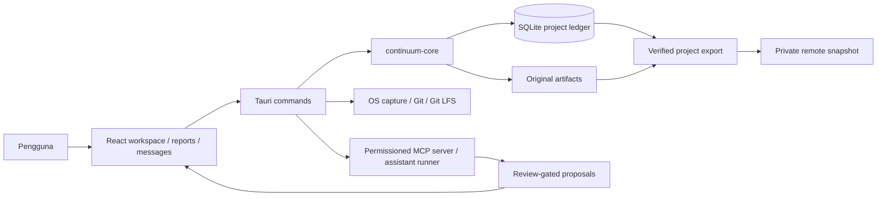

# Continuum — handover teknis

Dokumen ini adalah titik masuk untuk maintainer manusia maupun AI coding assistant. Baca [README](../README.md) untuk alur pengguna, [MAINTAINER-GUIDE](MAINTAINER-GUIDE.md) untuk cara mengubah dan menguji, lalu rujuk desain CP/ADR yang relevan. Periksa kode sebelum menganggap dokumen lama menggambarkan perilaku terbaru.

## Status dan batas rilis (1 Oktober 2026)

- Implementasi sampai CP12 ditambah perbaikan Linux untuk workspace, Markdown-first reports, capture/recording, Messages, GitHub browser login, snapshot proyek, dan upload responsif berada di working tree ini.
- AppImage pilot Linux terbaru yang tersedia secara lokal: `releases/0.12.0-github-upload-responsive-2026-10-01/Continuum_0.12.0_amd64.AppImage`. SHA-256 dan uji terakhir: [follow-up upload](cp12/2026-10-01-GITHUB-UPLOAD-RESPONSIVENESS.md). Jangan mengklaim pengujian ulang hanya karena kode terdokumentasi.
- Port Windows mempunyai konfigurasi dan workflow build, **belum** lolos acceptance test pada Windows nyata. macOS belum menjadi platform rilis. Lihat [Windows release gate](windows/WINDOWS-RELEASE.md) dan [known limitations](cp12/CP12-PLATFORM-AND-KNOWN-LIMITATIONS.md).
- Dokumentasi CP1–CP12 mencatat evolusi desain; beberapa angka tes dan gambar UI pada dokumen historis sudah usang. Prioritaskan kode saat ini, tes saat ini, dan dokumen follow-up bertanggal paling baru untuk perilaku terkini.

## Model mental

Setiap proyek Continuum adalah **folder lokal terpisah** yang dipilih pengguna. `continuum-core` membuka manifest, ledger SQLite, dan artifact asli di folder tersebut. Posisi kartu, relasi, chat, laporan Markdown, checkpoint, dan konteks yang telah disimpan merupakan data proyek. Path folder proyek bukan bagian dari source repository. Recent project dan beberapa preferensi perangkat disimpan di local storage desktop; kredensial AI/Git disimpan terpisah dari proyek.

## Peta source

| Kebutuhan | Titik masuk utama | Kontrak penting |
| --- | --- | --- |
| Model proyek, ledger, integritas, ekspor/impor | `crates/continuum-core/src/store.rs`, `manifest.rs`, migrations | Jangan memutus migrasi proyek lama; jaga original media dan ID stabil. |
| Research, evidence, provenance, graph | `research.rs`, `provenance.rs`, `workspace_content.rs` | Bedakan observasi, interpretasi AI, dan keputusan manusia. |
| Development Git dan code intelligence | `development.rs`, `code_intelligence.rs` | Analisis folder Git lokal tetap read-only terhadap repo pengguna. |
| Capture dan checkpoint/context | `capture.rs`, `context.rs` | Aktivasi sensor memerlukan tindakan/izin eksplisit; context pack dibatasi scope/privacy. |
| Report Markdown dan dokumen manusia | `human_document.rs`; UI `ReportStudio.tsx`, `MarkdownReading.tsx` | Simpan naskah proyek; ekspor HTML/Markdown harus aman, terbaca, dan dapat ditelusuri ke sumber. |
| UI workspace, media, pesan | `apps/continuum-desktop/src/Workspace.tsx`, `ResearchBoard.tsx`, `EvidenceMedia.tsx`, `Messages.tsx` | Posisi/link user tidak boleh ditimpa diam-diam AI; media asli dapat diputar dari evidence. |
| Native bridge, media, remote | `apps/continuum-desktop/src-tauri/src/main.rs`, `native_screen.rs`, `remote_sync.rs`, `github_cli.rs` | Simpan lokal lebih dulu; operasi network tidak boleh menahan lock global/UI. |
| MCP | `crates/continuum-mcp/`, `apps/continuum-desktop/src-tauri/src/workspace.rs` | Grant terbatas dan kedaluwarsa; proposal AI harus melalui review. |

Arsitektur mendalam: [domain model](domain/DOMAIN-MODEL.md), [data architecture](data/DATA-ARCHITECTURE.md), [AI architecture](ai/AI-ARCHITECTURE.md), [security](security/PRIVACY-AND-SECURITY.md), dan [human documentation](architecture/HUMAN-DOCUMENTATION-ARCHITECTURE.md).

## Alur yang harus tetap benar

1. Pengguna membuat/membuka folder proyek. Aplikasi memverifikasi ledger dan kemampuan Research/Development; Home dapat membuka lagi proyek sebelumnya bila path masih valid.
2. Bukti masuk lewat paste, drag/import, screenshot, web source, atau rekaman dengan izin. Original disimpan; judul dan deskripsi pengguna memberi konteks. AI tidak boleh mengarang isi audio/video yang belum ditranskripsikan atau menganggap gambar tak terbaca sebagai fakta.
3. Kartu/garis workspace adalah data proyek. Pengguna boleh mengatur, menghapus relasi, undo/redo, atau meminta AI mengusulkan hubungan beralasan. Perubahan AI penting memerlukan review manusia.
4. Bookmark/checkpoint menyimpan titik lanjut. Messages dan AI menggunakan konteks proyek yang dibatasi dan mempertahankan provenance; chat tidak boleh secara diam-diam mengubah fakta kanonik.
5. Report disusun dan diedit sebagai Markdown, dapat memakai Mermaid bila relevan, lalu diekspor ke HTML/Markdown. Tampilan report bukan sumber kebenaran baru; ledger dan evidence tetap otoritatif.
6. Snapshot GitHub/GitLab mengekspor keadaan **lokal terbaru** ke repository privat khusus data. Ledger dan media masuk Git LFS. Upload tidak melakukan pull/import dulu dan tidak force-push. Konflik remote harus berhenti tanpa menghapus pekerjaan lokal. Import selalu ke folder lokal **baru** dan diverifikasi sebelum dibuka.

## Riwayat implementasi dan keputusan

- `docs/cp1/`–`docs/cp5/`: fondasi proyek, Research/Development, code intelligence.
- `docs/cp6/`–`docs/cp8/`: provenance, semantic/visual intelligence, human reports.
- `docs/cp9/`–`docs/cp11/`: capture, checkpoint/context, permissioned MCP.
- `docs/cp12/`: desktop pilot, workspace UX, Markdown reports, native Linux capture, snapshot GitHub/GitLab, dan perbaikan terbaru. Mulai dengan [CP12 architecture](cp12/CP12-ARCHITECTURE-AND-RELEASE-CONTRACT.md), [workspace revision](cp12/CP12-WORKSPACE-REVISION.md), [native A/V](cp12/2026-09-30-NATIVE-AV-RECORDING.md), [project snapshots](cp12/2026-09-30-PROJECT-REMOTE-SNAPSHOTS.md), dan [upload responsiveness](cp12/2026-10-01-GITHUB-UPLOAD-RESPONSIVENESS.md).
- `docs/adr/`: keputusan desain yang menjadi alasan batas keamanan dan workflow. Baca ADR-007 hingga ADR-010 saat mengubah report, capture, context, atau MCP.

## Hal yang **tidak** otomatis terbawa saat handover

Source repo ini tidak memuat proyek riset pribadi, database/media pengguna, credential `gh`, izin OS, kunci AI, atau recent-project list perangkat. Untuk memindahkan **data proyek**, gunakan ekspor/impor aplikasi atau snapshot privat GitHub/GitLab + Git LFS. Setelah import, hubungkan ulang AI client/Git pada mesin baru. Jangan meminta seseorang menyalin token ke source repo.

## Cara memulai perubahan

Sebelum coding: baca issue/permintaan, cek `git status`, telusuri jalur UI → Tauri → core → storage, serta dokumen CP/ADR terkait. Lakukan perubahan sekecil yang aman, tambah tes pada boundary yang berubah, jalankan tes frontend/core/desktop yang relevan, dan catat hasilnya. Lihat [panduan pemeliharaan](MAINTAINER-GUIDE.md) untuk perintah dan release gate. Jangan mengedit repo data pribadi atau mengklaim dukungan lintas platform tanpa uji sebenarnya.
