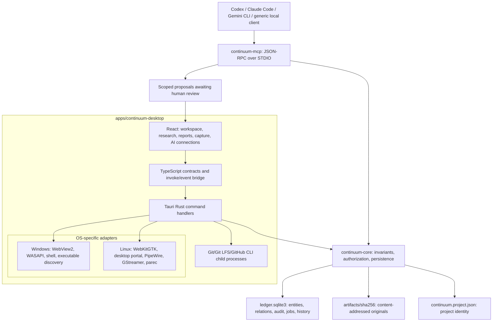
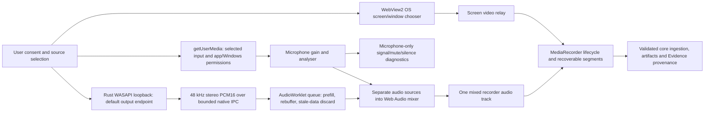
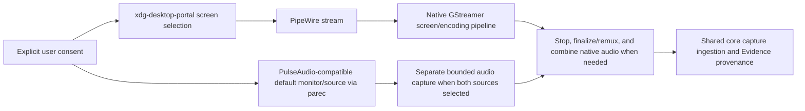
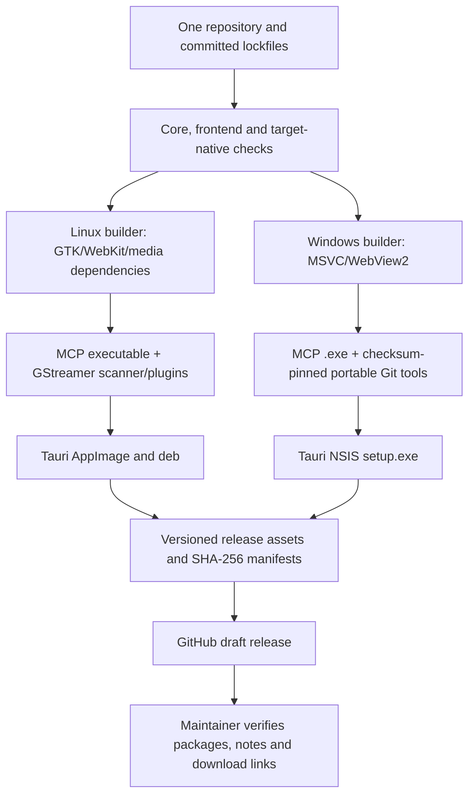

# Continuum Linux and Windows architecture

## Design and platform boundary

Continuum uses one React/TypeScript UI, one deterministic Rust domain core, one project format, and one local MCP protocol. Windows is a platform port of that codebase. It does not have a reduced project database or a second implementation of the Research/Development rules.



Both the desktop and MCP companion open the same canonical core under its project/authorization rules. MCP access is bounded by a project-scoped expiring grant. There is no enabled remote Streamable HTTP endpoint in this delivery. The AI-facing interface does not give models direct authority to write arbitrary project files or canonical database rows.

## Layers and source locations

| Layer | Responsibilities | Source |
| --- | --- | --- |
| Presentation | Project launcher, board, questions/evidence, diagrams, reports, Messages, resume UI | `apps/continuum-desktop/src/` |
| Frontend capture | Source selection, consent, microphone test/gain, PCM queue, stream composition, recorder lifecycle | `CapturePanel.tsx`, `microphone.ts`, `captureMedia.ts`, `systemAudio.ts`, `audioPcmQueue.ts`, `systemAudioProcessor.ts` |
| Desktop boundary | Validated commands, project state, artifact preview, native resource lifecycle | `apps/continuum-desktop/src-tauri/src/main.rs`, `workspace.rs`, `assistant.rs` |
| Domain | Research, Development, Code Intelligence, provenance, semantic contracts, reports, capture, context, grants/reviews | `crates/continuum-core/src/` |
| Persistence | Versioned SQLite migrations, transactions, audit/outbox, integrity, export/import | `crates/continuum-core/migrations/`, `store.rs`, `artifact.rs`, `manifest.rs` |
| AI protocol | Local STDIO server, tools/resources/prompts and scoped responses | `crates/continuum-mcp/src/`; grant/proposal rules in core `mcp.rs` |
| Platform integration | OS permissions/capture, shell opening, paths and executable resolution | Desktop native `platform.rs`, `media_permissions*.rs`, `system_audio*.rs`, `native_screen.rs` |
| Git snapshots | Explicit snapshot publication/independent restore, LFS, account/repository selection | Desktop native `remote_sync.rs`, `github_cli.rs` and React remote panels |
| Packaging | Platform resource maps, MCP staging, plugins/tools, NSIS/AppImage/deb | Tauri configuration, frontend `scripts/`, repository `packaging/` |

## Project format and portability

```text
<project-folder>/
  continuum.project.json      # manifest v1, identity and relative ledger filename
  ledger.sqlite3              # canonical project state; core schema currently v15
  artifacts/sha256/            # original content addressed by SHA-256
  ...                         # core-created exports, backups, supporting folders
```

Schema and manifest versions are independent of application `0.12.0`. Historical CP12 documents describe earlier schema revisions; current constants live in `crates/continuum-core/src/lib.rs`. Never infer database compatibility solely from an installer filename. Use forward migrations and complete, verified project export/import rather than copying a live SQLite file in isolation.

Repositories, application recent-project preferences, machine-specific executable paths, and AI client settings are external integration state. A Linux path such as `/home/...` is not translated into a Windows path automatically. Relocate the repository and reconnect local clients after transfer. Preserve original exports and verify restored artifact hashes. Full Linux→Windows→Linux physical round-trip qualification is still outstanding.

## Windows capture flow



Windows screen selection is OS-mediated. System audio uses WASAPI loopback, not microphone feedback or a virtual cable. COM capture objects stay on their capture thread. The AudioWorklet uses a bounded stereo queue (250 ms capacity, 100 ms prefill); transient renderer delays rebuffer and drop stale backlog. Native hardware errors or a genuinely stalled receiver still terminate safely while preserving saved segments. An older WebView scheduling fallback remains bounded.

The microphone stream is kept separate until mixing. The app requests echo cancellation, noise suppression, and automatic gain control off; actual support remains browser/device-dependent. The analyser is in the processed microphone path, so system audio cannot falsely make the microphone meter show signal. A ten-second microphone test releases its input/context without creating a recording. Capture cancellation/error/stop disconnects the mixer and releases owned streams; microphone gain affects its own path only.

`media_permissions_windows.rs` accepts only the local app origin and presents per-request microphone permission. It obtains the parent from the initialized WebView2 controller. Remote/lookalike origins and camera requests are denied. Windows desktop microphone privacy settings and VM audio routing are outside the app's permission handler.

## Linux capture flow



The native Linux screen path remains in `native_screen.rs`. Packaged GStreamer elements/scanner support WebKit/media operations as well as native paths. Audio-only/browser-supported paths use the shared capture pipeline and Linux system-output adapter where applicable. The native screen+system+microphone path captures monitor/source separately and mixes after capture; it is not identical to Windows' live Web Audio composition.

The feature intent and stored evidence are shared; permission APIs, real-time transport, codec availability, and finalization differ. Actual behavior depends on the desktop portal backend, PipeWire/PulseAudio routing, installed utilities, and codecs. A successful headless package build does not exercise these dependencies as a logged-in user.

## Feature/status matrix

| Area | Linux implementation | Windows implementation | Qualification boundary |
| --- | --- | --- | --- |
| Project modes, Research, board, Messages, reports | Shared core/UI | Shared core/UI | Keep feature and migration regression tests |
| Development/code intelligence/provenance | Shared Git/core analysis | Shared analysis with Windows paths/tools | Repository/platform edge cases still need coverage |
| Checkpoints/context/grants/proposals | Shared core/MCP | Shared core/MCP | Real client versions and human review flow |
| Screen | Portal/PipeWire/GStreamer | WebView2 chooser + recorder | Windows user reported working; full host/device matrix incomplete |
| System audio | PulseAudio-compatible monitor | WASAPI loopback + AudioWorklet | Windows user reported working after fix1; long/device/sleep tests remain |
| Microphone | Linux media/native input path | WebView2 input, gain/test/meter | Physical signal still absent on reference Windows VM; unresolved |
| Distribution | AppImage / `.deb` | Current-user NSIS `.exe` | Unsigned pilots, no automatic updater |
| Data portability | Same manifest/schema/artifacts | Same manifest/schema/artifacts | Complete cross-machine round-trip not yet certified |
| macOS/ARM64 | Not qualified here | Not qualified here | No advertised package |

## Build and delivery architecture



Use [build instructions](../development/BUILD-AND-DEVELOP.md) and [publishing instructions](../releases/PUBLISHING.md). The new cross-platform workflow is build/release infrastructure, not evidence that its hosted jobs or live package checks have already run. Release artifacts include exact filenames/hashes and disclose unsigned status and open device issues.

## Related contracts

- [Data architecture](../data/DATA-ARCHITECTURE.md)
- [Domain model](../domain/DOMAIN-MODEL.md)
- [Privacy/security](../security/PRIVACY-AND-SECURITY.md)
- [AI architecture](../ai/AI-ARCHITECTURE.md) and [MCP interface](../ai/MCP-CONTINUITY-INTERFACE.md)
- [Native capture ADR](../adr/ADR-008-OS-MEDIATED-SEGMENTED-CAPTURE.md)
- [Windows release status](../windows/WINDOWS-RELEASE.md)
