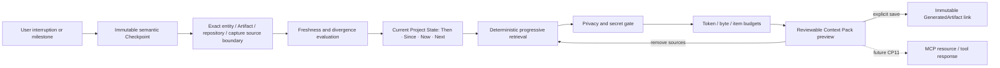

# CP10 — Checkpoint & Context Engine Architecture and Contract

> **Status:** Implemented and validated  
> **Contract:** `context` v1  
> **Database:** schema v11

## 1. Outcome

CP10 turns Continuum's existing bookmarks into a complete continuity engine. A person can stop Research, Development, connected R&D, or whole-project work; later see **Then / Since / Now / Next**; detect whether the saved boundary is stale; and build a purpose-bound Context Pack for themselves, another person, an API model, or a CP11 MCP client.

This completes the central product promise without changing CP1's architecture: Research and Development remain independently usable, their connection remains optional, canonical truth remains deterministic, and AI remains advisory.

## 2. Component Flow

## 3. Checkpoint Contract

`SemanticCheckpointInput` declares scope, trigger, note, blockers, risks, next actions, optional accepted semantic candidate, and optional superseded Checkpoint. Supported scopes are `research`, `development`, `integrated`, and `core`. Research/Development require only their own enabled Space; Integrated requires both; Core is always available.

Creation captures, in one transaction:

- exact Project Ledger sequence;
- every in-scope canonical entity ID and version, bounded to 2,000;
- linked Artifact hash, availability, and classification;
- live repository identity/head/worktree snapshot where applicable;
- latest committed capture session/segment/marker boundary, never an in-memory recorder buffer;
- deterministic state, privacy policy snapshot, and SHA-256 material fingerprint;
- an accepted and fresh CP7 semantic candidate only when explicitly supplied.

Checkpoint and source rows are immutable. Correction creates a new Checkpoint using `supersedes_checkpoint_id`. An AI actor cannot create canonical Checkpoints.

Legacy CP2/CP3/CP5 Checkpoints remain readable through a synthesized, explicitly labelled `legacy-unspecified` envelope; IDs and stored rows are not rewritten.

## 4. Freshness and Current Project State

Freshness compares the saved boundary with current canonical state. It reports changed/missing entities, changed/unavailable Artifacts, relevant later events, repository divergence/unavailability, capture advancement, and privacy-policy change. Checkpoint/context/report creation events are excluded from material-staleness decisions.

`CurrentProjectState` separates:

- **Then:** deterministic snapshot saved at the Checkpoint;
- **Since:** bounded ordered audit events after the boundary;
- **Now:** freshly computed scope state and live repository/capture observations;
- **Next:** the explicit next actions saved by the user.

The API never claims an old Checkpoint is current merely because its prose still sounds correct.

## 5. Context Pack Request

The request declares task, audience, consumer target, scope, optional Checkpoint, freshness requirement, retrieval profile, explicit roots/exclusions, Artifact-content permission, and all budgets. Retrieval profiles are `resume`, `research`, `development`, `integrated`, and `custom`; a profile that conflicts with its scope is rejected.

`current` fails closed on a stale selected Checkpoint. `allow_stale_with_warning` preserves the explicit stale status in the output.

## 6. Deterministic Progressive Retrieval

Candidates are selected and ordered by a stable `(tier, score, kind, ID)` key:

1. filtered project state and selected Checkpoint;
2. explicit roots and exact Checkpoint sources;
3. task-matched or active entities and relationships between selected entities;
4. explicitly permitted linked Artifact metadata/content.

Exact source versions and content fingerprints are included. Per-item structured content is deterministically compacted when necessary. When a soft or hard limit is reached, remaining material stays discoverable through omission metadata and later progressive retrieval.

Repeated selection over the same canonical state and request produces the same request fingerprint, content fingerprint, ordered source identities, and source versions. Preview IDs and timestamps are intentionally new instances.

## 7. Privacy Boundary

Audiences are:

- `local_user`: may include all classifications within the local project boundary;
- `external_ai`: Public and Internal only;
- `public_portable`: Public only.

Explicit roots denied for the audience fail the request. Other denied sources are omitted with reason. A local secret-pattern scan also blocks suspicious credentials before any external/public pack is composed. Artifact payloads are excluded unless explicitly requested, available, bounded, textual, valid UTF-8, and permitted. Raw capture media is never embedded by default.

This gate composes with, but does not replace, CP7 provider policy/consent and future CP11 client grants.

## 8. Persistence and Concurrency

Previews are ephemeral. `save_context_pack` verifies that the Project Ledger and each source version/fingerprint still match the preview. It then atomically writes the existing `context_packs` base row, v1 record, ordered sources, GeneratedArtifact, audit event, and command receipt. Changed state produces a conflict requiring rebuild. Retrying the same command is idempotent.

Schema v11 is additive and forward-only. It adds `checkpoint_envelopes`, `checkpoint_artifact_sources`, `context_pack_records`, `context_pack_sources`, and `context_pack_generated_artifacts` plus immutability triggers. A pre-migration backup remains governed by CP2.

## 9. Desktop Experience

The Tauri/React surface provides:

- a scope selector that exposes only valid Research/Development/Integrated options plus Core;
- smart bookmark fields for stop point, blockers, risks, and next actions;
- Then/Since/Now/Next cards and visible freshness reasons;
- Checkpoint selection and comparison;
- Context Pack purpose/audience controls, stale opt-in, Artifact-content opt-in;
- local preview with usage, privacy policy, included/omitted sources, per-source removal, and explicit save.

Building a preview never invokes an external AI or network transport.

## 10. Failure Semantics

- disabled/mismatched scope, duplicate roots/exclusions, invalid IDs or budgets: validation error;
- stale Checkpoint under `current`: conflict;
- denied explicit root: fail closed;
- canonical or source change after preview: conflict and rebuild;
- missing repository/Artifact/capture source: explicit freshness/unavailable reason;
- oversized item: deterministic bounded representation, never unbounded allocation;
- incomplete saved publication: integrity diagnostic with repair guidance.

## 11. CP11 Handoff

CP11 receives stable, versioned read contracts for Checkpoint envelopes, comparisons, Current Project State, and Context Packs. It may expose them through a project-scoped MCP server and accept reviewable proposals. CP11 must add client authentication/grants/session auditing and must reapply audience/privacy limits; it cannot create a bypass around CP10 or grant AI canonical write authority.
