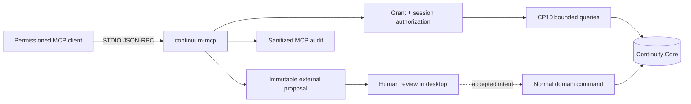

# CP11 — AI Continuity Interface Architecture and Contract

> **Status:** Implemented and validated  
> **Build:** `continuum-core`, `continuum-mcp`, and desktop `0.11.0`; schema v12  
> **Protocol contract:** MCP v1; negotiated protocol `2025-06-18`, `2025-03-26`, or `2024-11-05`

## 1. Outcome

CP11 turns CP10's bounded continuity state into a safe interface for external AI clients. Codex, Claude Code, Gemini CLI, or a generic MCP host can resume a project, inspect checkpoints and provenance, and submit reviewable proposals without direct access to storage, files, commands, credentials, or canonical writes.

## 2. Boundary

The MCP server is an inbound adapter. The CP7 provider gateway remains the outbound adapter. Neither can call around the other or bypass CP1 deterministic authority.

## 3. Lifecycle and Transport

1. A user creates a project-scoped grant in the desktop app.
2. Continuum reveals the bearer token once; only its SHA-256 digest is stored.
3. The MCP host launches `continuum-mcp` with a fixed project path and token environment variable.
4. The client sends `initialize`; Continuum negotiates a supported protocol and validates the grant/client profile.
5. The client sends `notifications/initialized`; only then are operational calls accepted.
6. Each call is independently authorized and audited.
7. Revocation immediately closes active sessions. Process/transport closure also closes the session.

STDIO accepts one UTF-8 JSON-RPC object per line. Stdout contains protocol messages only; diagnostics go to stderr. Streamable HTTP is fail-closed in v0.11.

## 4. Authorization Contract

A grant freezes: project, client family, transport, scopes, resource families, tools, proposal capability, classification ceiling, artifact/request/response/context budgets, call rate, timeout, expiry, and creator. Grant authority is immutable; the user revokes and replaces it to change access.

Authorization is checked during initialization and every request. Cross-project IDs, revoked/expired grants, inactive sessions, unavailable Spaces, unauthorized scopes/resources/tools, secret markers, classifications above the ceiling, and oversized/rate-limited calls fail closed.

Desktop defaults are local STDIO, seven-day expiry, Internal ceiling, 16K hard context tokens, 120 calls/minute, 30-second declared timeout, and zero artifact-content bytes.

## 5. Frozen v1 Catalog

Tools:

- `continuum.project.get_state`
- `continuum.checkpoint.get`
- `continuum.checkpoint.list`
- `continuum.context.build`
- `continuum.entity.get`
- `continuum.research.search`
- `continuum.provenance.trace`
- `continuum.proposal.submit`
- `continuum.proposal.get_status`

Static resources:

- `continuum://project/summary`
- `continuum://schema/mcp-v1`
- `continuum://checkpoints`
- `continuum://context-packs`

Resource template: `continuum://project/current-state{?scope,checkpoint_id}`.

Prompts: `continuum.resume`, `continuum.explain_research`, `continuum.trace_rationale`, `continuum.propose_next_actions`, and `continuum.development_handover`. Catalogs are filtered by the authenticated grant.

## 6. Response Contract

Tool results include MCP text content for compatibility and the same object as `structuredContent`. Context responses retain CP10 schema version, audience, consumer target, scope, checkpoint/ledger boundary, freshness, estimator, source IDs, fingerprints, omissions, and declared budgets. List calls are bounded and cursor-paginated. The Context Pack resource index exposes safe metadata only, removes task/audience text, and filters non-portable/private packs using the grant ceiling.

Structured errors use JSON-RPC codes plus safe kinds: validation, not found, unauthorized, rate limited, conflict, unsupported schema, integrity failure, and internal failure. Tool failures include a correlation ID and retryability without raw secrets or stack traces.

## 7. Proposal Contract

Proposal kinds are research note, Finding candidate, Decision candidate, Requirement candidate, relationship candidate, and next action. Input is idempotent per grant, bounded, source-referenced, secret-scanned, fingerprinted, expiring, and immutable.

`proposal.submit` returns `canonical_state_changed: false` and `review_required: true`. Proposal status is visible only to the grant that created it. Desktop review requires a human actor and optimistic version. Accept/reject is auditable; acceptance does not silently materialize the candidate as a domain entity.

## 8. Failure and Independence

Malformed messages, unknown methods/tools, incomplete initialization, client mismatch, invalid token, revocation, oversized calls, cancellation, time-budget excess, and privacy denial cannot crash or partially mutate canonical state. Pending cancellation state is bounded. Research search is authorized before querying, artifact limits are exact, resource URIs are matched strictly, and unauthorized search results or provenance nodes are counted as omissions without revealing their identifiers. MCP is not required to open, capture, research, develop, checkpoint, build a local Context Pack, or render Human Documentation.

## 9. CP12 Handoff

CP12 owns signed packaging, live then-current client releases on supported operating systems, process-group cancellation/termination, long-duration soak, remote transport decision, accessibility, backup/restore and corrupt-project drills, and published support dates. These do not reopen the CP11 domain or catalog unless evidence requires a new ADR/version.
