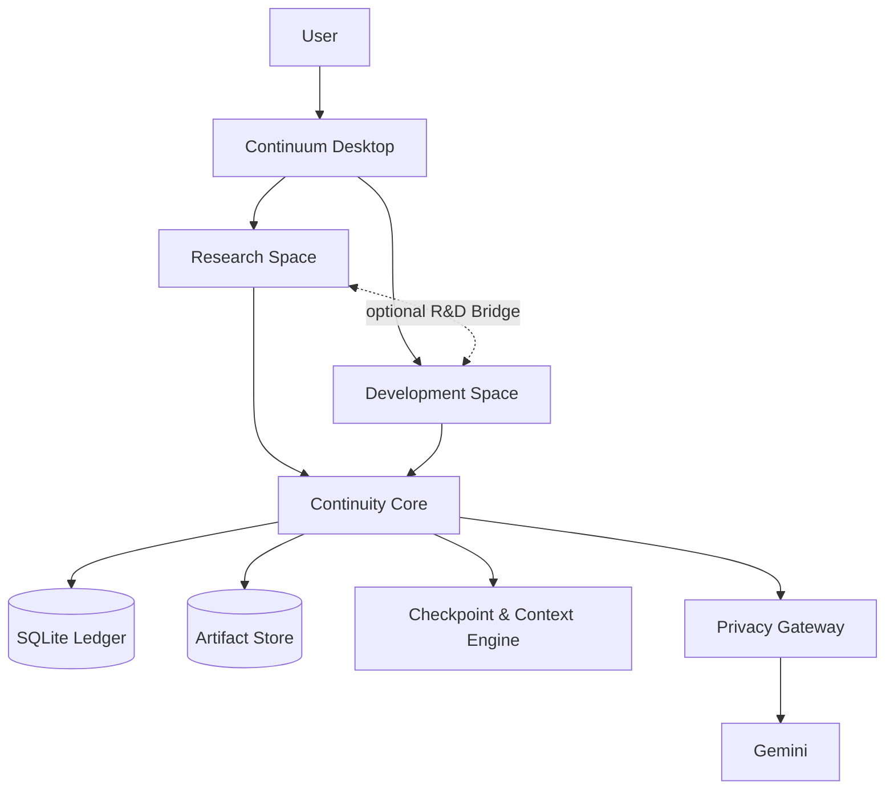
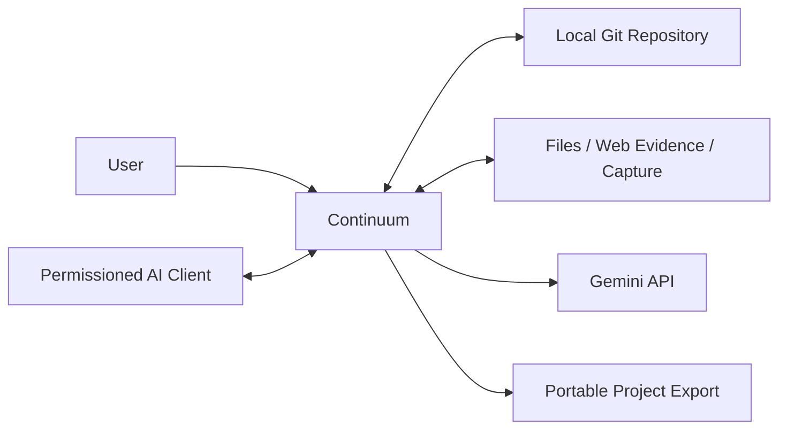
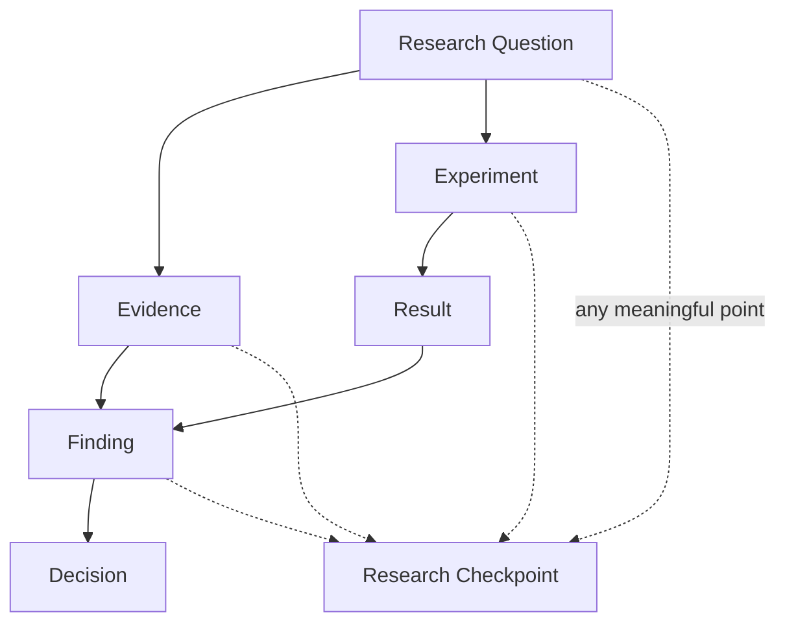
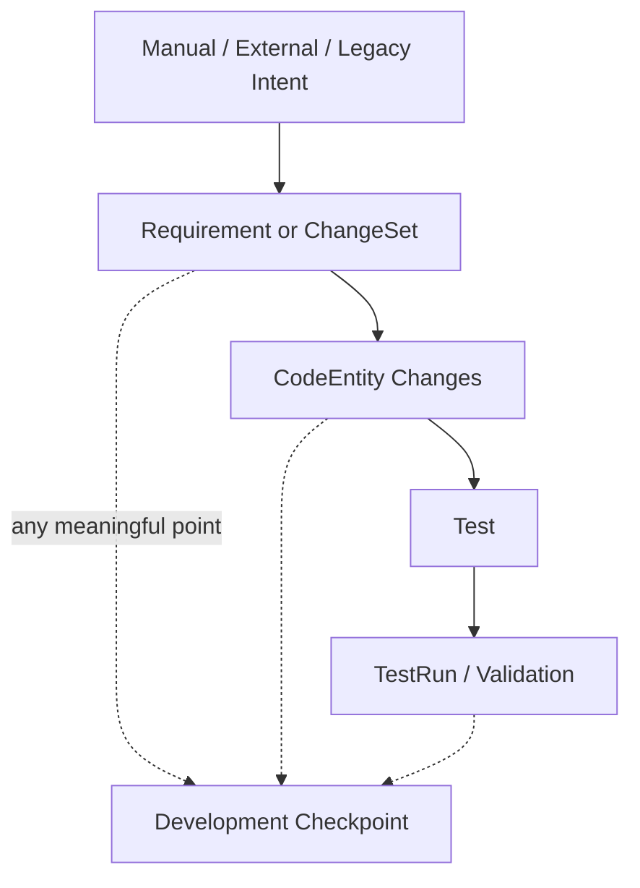
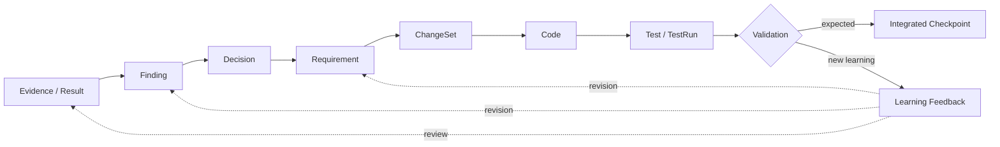
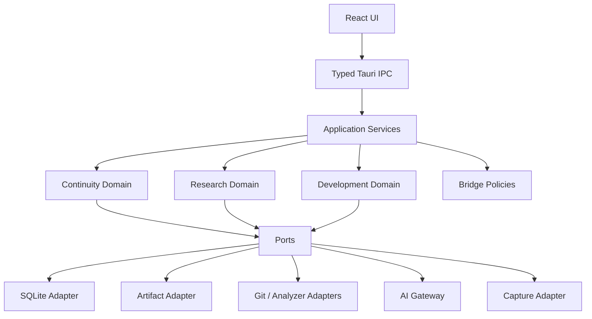
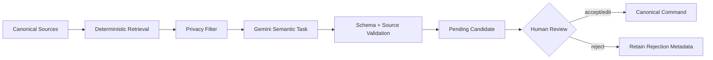
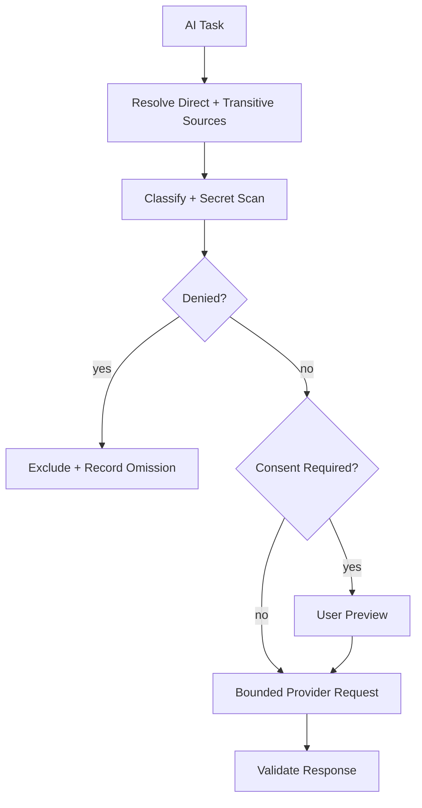
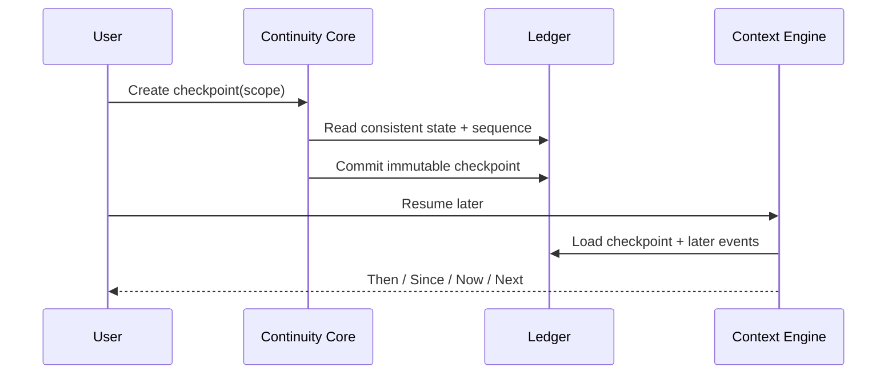
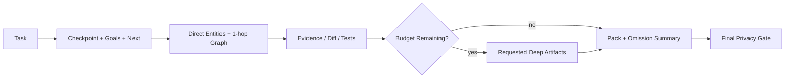

# Continuum Core Architecture Diagrams

> **Status:** Approved CP1 Mermaid sources. Written architecture remains authoritative when rendering support differs.

## 1. Big Picture

## 2. System Context

## 3. Research-only

## 4. Development-only

## 5. Connected R&D Loop

## 6. Component Architecture

## 7. Deterministic and Semantic Boundary

## 8. AI Privacy Flow

## 9. Checkpoint Resume

## 10. Context Pack

