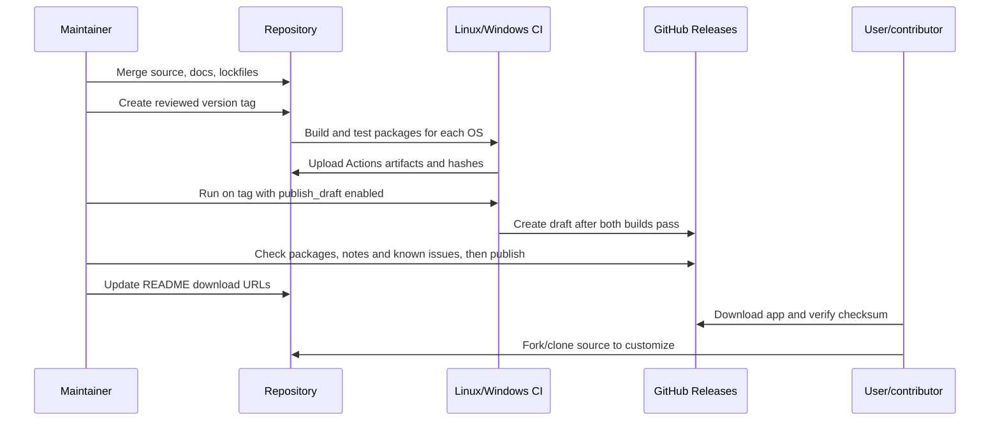

# Releases: Linux packages, Windows installers, and editable source

## Distribution layout

The repository contains source, lockfiles, documentation, and build scripts. GitHub Releases contains downloadable application packages, package-specific notes, and SHA-256 files. Users download a complete app; contributors fork/clone the source. Keep `target/`, `node_modules/`, downloaded portable tools, and binary installers out of Git history.

The existing Linux pilot and the Windows fix2 pilot are different platform artifacts of application version `0.12.0`. Their hardware qualification differs. Adding Windows must preserve the Linux package and its historical evidence. Never relabel the old Linux binary as a newly built cross-platform version.

## Publish the existing Windows fix2 package

Use the already validated file `Continuum_0.12.0_Windows-fix2_x64-setup.exe`, not a freshly renamed old installer or the bare application executable. It is 60,893,044 bytes and has SHA-256 `4fc2f79d7602011be0ec1208ce33c5222645a6be45b92cee5c1d6d67acfc4f34`.

1. Verify repository access and inspect its current default branch, tags, releases, and assets. Compare the existing Linux source with the migration source before merging; do not overwrite newer Linux work from a stale source copy.
2. Merge the Windows implementation and cross-platform documentation through a reviewed commit/PR. The release tag must identify source containing the implementation used by the Windows binary. Documentation/build-script changes can follow the application build without changing its compiled logic; record that distinction.
3. Add the fix2 installer and its own checksum file to the existing `0.12.0` Linux release if its tagged source is appropriate. Otherwise create a separate clearly labeled Windows pilot/prerelease tag such as `v0.12.0-windows-fix2`, preserving the previous Linux release/assets.
4. Use [Windows fix2 notes](WINDOWS-0.12.0-fix2.md) for the body. Include the microphone no-signal issue, unsigned status, build target, and limits. The original fix2 source archive may be attached with its recorded hash; GitHub's automatically generated source archive at the tag includes later repository documentation as well.
5. Verify the asset through the Releases page and its exact download URL. Then replace the README's **prepared for publication** status with a link to the published asset. Keep the Linux download link pointing to the existing Linux package/release.

Example CLI commands, after signing in normally with GitHub CLI and after the chosen tag/source have been reviewed:

```bash
gh auth status
gh release view v0.12.0-windows-fix2 --repo WiefranVarenzo/Continuum
# Only if this release does not already exist, create it as a draft:
gh release create v0.12.0-windows-fix2 --repo WiefranVarenzo/Continuum \
  --verify-tag --draft --prerelease --title 'Continuum 0.12.0 — Windows fix2 pilot' \
  --notes-file docs/releases/WINDOWS-0.12.0-fix2.md \
  /path/to/Continuum_0.12.0_Windows-fix2_x64-setup.exe /path/to/SHA256SUMS-Windows-fix2.txt
```

Paths are examples: supply the real package/checksum paths. `--verify-tag` intentionally refuses to invent a tag/source relationship. If adding assets to an existing release, use `gh release upload <actual-tag> <files> --repo WiefranVarenzo/Continuum` without `--clobber`; inspect collisions instead of overwriting assets. Publishing the draft is the maintainer's final release action.

Once published, the exact Windows asset URL has the form:

```text
https://github.com/WiefranVarenzo/Continuum/releases/download/<actual-tag>/Continuum_0.12.0_Windows-fix2_x64-setup.exe
```

Use the actual tag, not a guessed latest-download filename. Prereleases may not appear under `releases/latest`. Private repositories restrict both source and release downloads to authorized users; do not change visibility implicitly.

## Future cross-platform builds

`.github/workflows/desktop-release.yml` has an Ubuntu 24.04 Linux job and a Windows MSVC job. Tag pushes build/test and upload **Actions artifacts**. Manual runs also build/test; selecting `publish_draft=true` on an existing `v*` tag creates a GitHub **draft release** only after both jobs pass. The workflow does not publish a public release automatically. A draft is not yet a user-download announcement.

The existing `.github/workflows/windows-desktop.yml` remains available for Windows-only diagnostic builds. The new hosted workflow has been locally inspected; its real GitHub jobs must be run and checked before claiming hosted CI success.



## Stage locally built packages

From the repository root, after a Windows MSVC build:

```bash
node apps/continuum-desktop/scripts/stage-release.mjs windows x86_64-pc-windows-msvc release-assets/windows
```

For the GNU alternative substitute `x86_64-pc-windows-gnu`. After a native Linux x86-64 build:

```bash
node apps/continuum-desktop/scripts/stage-release.mjs linux native release-assets/linux
```

The helper requires exactly one matching package per format for the configured application version, copies complete packages, computes SHA-256, and refuses to overwrite staged files. Use a fresh output directory for each build. Generated filenames are `Continuum_<version>_windows_x64-setup.exe`, `Continuum_<version>_linux_x86_64.AppImage`, and `Continuum_<version>_linux_amd64.deb`; checksums are platform-specific to avoid collisions when CI artifacts merge. Existing fix2 assets retain their exact historical filenames.

Generated packages are different from GitHub's automatic `Source code (zip/tar.gz)`. Keep the tagged source buildable, including frontend/desktop lockfiles, migrations, icons, packaging scripts, and CI definitions. Downloaded third-party tools are rebuilt/staged from pinned upstream sources and include their license files. Never bundle user credentials, MCP secrets, projects, or recordings in a source archive.

## Before publication

- Verify the tag/commit, package hashes, asset names, and downloadable URLs.
- Install/launch the complete packages as normal users; preserve project data during upgrades and test export/import with copies.
- Run affected device/portal/client checks separately from headless/synthetic tests; state what is unresolved.
- Confirm installers contain the MCP companion/resources and Linux packages contain required GStreamer plugins/scanner.
- Describe unsigned status, required runtime/network setup, supported CPU/OS scope, and updater status.
- Keep historical Linux assets accessible when adding Windows; distinguish current evidence from old checkpoints.

Official references: [GitHub release management](https://docs.github.com/en/repositories/releasing-projects-on-github/managing-releases-in-a-repository), [Tauri prerequisites](https://v2.tauri.app/start/prerequisites/), [AppImage](https://v2.tauri.app/distribute/appimage/), and [Windows installer](https://v2.tauri.app/distribute/windows-installer/).
